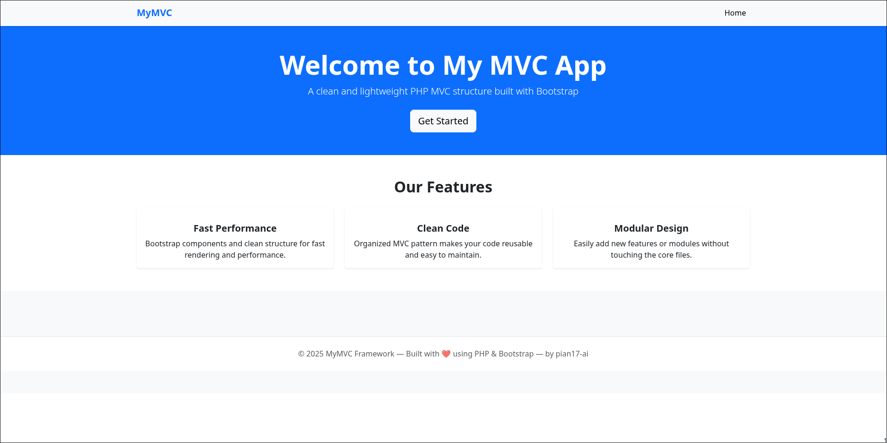

# 🧩 PHP MVC Bootstrap Template

A simple and modern **PHP MVC template** built with **pure Bootstrap 5** — clean, responsive, and lightweight.  
Perfect for learning, building small projects, or using as a personal starter framework.

---

## 🚀 Features

- 🔹 **MVC architecture** (Model - View - Controller)
- 🔹 **Fully responsive** layout using Bootstrap 5
- 🔹 **No custom CSS** — pure Bootstrap only
- 🔹 Simple, clean, and easy to extend
- 🔹 Ready for routing and database integration

---

## 🗂️ Folder Structure

```text
MyMVC/
│
├── app/
│ ├── controllers/
│ │ ├── AboutController.php
│ │ └── HomeController.php
│ │
│ ├── core/
│ │ ├── App.php
│ │ ├── Constants.php
│ │ └── Controller.php
│ │
│ ├── helpers/
│ │ └── php.ini
│ │
│ ├── views/
│ │ ├── About/
│ │ │ 	├── aboutme.php
│ │ │   └── index.php
│ │ │
│ │ ├── Home/
│ │ │ └── index.php
│ │ │
│ │ └── templates/
│ │   ├── footer.php
│ │   └── header.php
│ │
│ ├── .htaccess
│ └── init.php
│ 
├── assets/
│ └── home.png
│
├── public/
│ ├── css/
│ ├── js/
│ ├── img/
│ │ └── preview.png
│ │
│ ├── .htaccess
│ └── index.php
│
└── README.md
```

---

## Home Page

---

# MODELS and DATABASE coming soon ...
